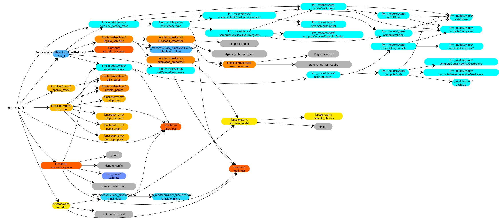

# Documentation of code for heterogeneous firm model

In this document we describe the workings of the main Matlab functions for Bayesian inference in the heterogeneous firm model in Section 5 of [our paper](https://scholar.princeton.edu/mikkelpm/het_agents).

Since the structure and specifics of the code are very similar to that for the heterogeneous household model, we refer to the documentation for [that model](hh.md). Below we will only describe the key parts in which the heterogeneous firm model code differs from the heterogeneous household model code.

## Main executable: [run_mcmc_firm.m](../program/run_mcmc_firm.m)

This file executes the MCMC algorithm for the heterogeneous firm model. At the top of the file there are various settings. The ones that are specific to the firm model are as follows:
- `exper_type`: This integer determines which set of parameters are estimated and whether to consider data subject to selection on firm size (truncation). The three different choices produce, respectively, the results in Section 5.3 of our paper, Section 5.4 of our paper, and Section D.3 of the Online Appendix.
- `trunc_quant`: This variable specifies the quantile of the firm size distribution below which we do not observe data. For example, a value of `0.9` means that we only sample firms whose current-period employment exceeds the 90th percentile of the steady-state distribution of firm employment.

## Model solution in Dynare

The Dynare model file is called [dynamicModel.mod](../program/firm_model/dynare/dynamicModel.mod), and it patches together the following three files, which have all been written by Thomas Winberry (with minor modifications by us):
- [parameters.mod](../program/firm_model/dynare/parameters.mod): define model parameters
- [variables.mod](../program/firm_model/dynare/variables.mod): define model variables
- [equations.mod](../program/firm_model/dynare/equations.mod): equilibrium conditions

## Compute truncation point

If the experiment being run involves selection of firms by size, the code computes the lower threshold for the truncation. The formula exploits the fact that the cross-sectional distribution of firm state variables (log capital and productivity) is approximated using a multivariate normal distribution when solving the model in Dynare. To apply our code to real-world data, this part may be ignored, since the threshold can either be known or be treated as another parameter to be estimated from the available data.

## Simulate data

The function [simulate_micro.m](../program/firm_model/auxiliary_functions/sim/simulate_micro.m) simulates micro data on capital and employment across firms. It exploits the fact that we're using a multivariate normal approximation for the cross-sectional distribution of firm state variables. The bottom of the file removes data that falls below the selection threshold for employment computed earlier.

## Evaluate micro likelihood

The model-specific [likelihood_micro.m](../program/firm_model/auxiliary_functions/likelihood/likelihood_micro.m) function evaluates the sampling density of the micro data (capital and employment) conditional on smoothing draws of the macro state variables. The density takes into account firm selection, if applicable, using the formula in Section 5.4 in our paper.

## Visualization of file dependencies

The following figure visualizes the dependencies between the various files used for the heterogeneous firm model (please zoom in for details).[^1] The color coding is as follows:
- Shades of yellow-orange: generic functions in folder [program/functions](../program/functions). Different shades indicate files in different sub-folders.
- Shades of blue: model-specific files in folder [program/firm_model](../program/firm_model). Different shades indicate files in different sub-folders.
- Gray: built-in [Dynare](https://www.dynare.org/) functions.

[^1]: The code generating this visualization is adapted from the following package: Pedersen, C. (2022). [plot_depfun](https://www.mathworks.com/matlabcentral/fileexchange/46080-plot_depfun), MATLAB Central File Exchange. 