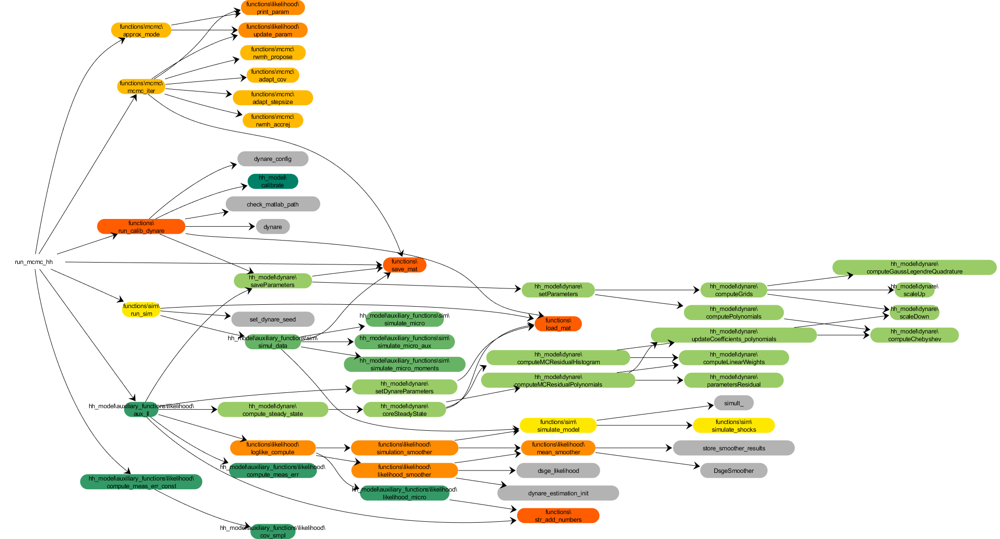

# Documentation of code for heterogeneous household model

In this document we describe the workings of the main Matlab functions for Bayesian inference in the heterogeneous household model in Sections 2.2 and 4 of [our paper](https://scholar.princeton.edu/mikkelpm/het_agents). Our aim is to sketch the structure and interactions of the different components of the code; inline comments in the code itself provide greater detail.

Familiarity with [Thomas Winberry's original code](https://www.thomaswinberry.com/research/index.html) for solving the heterogeneous household model is useful for understanding our code, as we use many of his files directly with few changes.

## Main executable: [run_mcmc_hh.m](../program/run_mcmc_hh.m)

This model-specific file executes the MCMC algorithm for drawing from the posterior distribution of the parameters in the household model.

The settings at the top of the file determine the specifics of the model, the inference procedure, and the numerical algorithms. Prominent settings include:
- Overall
  - `is_run_dynare`: This boolean determines whether the [Dynare](https://www.dynare.org/) preprocessor is run at the beginning of the program. If the program has been run previously, and no edits have been made to the Dynare model files (described further below), then it is not necessary to run the preprocessor again.
  - `is_data_gen`: This boolean determines whether data is simulated anew. If the program has been run previously, and the data settings have not been changed, it is not necessary to resimulate data, and the program will simply load the previously stored simulated data.
  - `likelihood_type`: This integer variable determines what kind of data is used to compute the likelihood for use in Bayesian inference. This can include macro and micro data. It is also possible to use the micro data only through certain cross-sectional moments (1st, 2nd, 3rd), as discussed in Sections 3.3 and 4.4 of our paper.
  - `serial_id`: This integer determines the random number seed for simulations. It will also determine the file name for stored `.mat` files created by the program. It is possible to run the program several times in parallel on a server, since program instances with different values of `serial_id` will not conflict with each other.
  - `mat_suff`: This string determines the file name of saved `.mat` files. It ensures that different instances of the program will not conflict with each other if run in parallel.
- Data
  - `T`, `ts_micro`, and `N_micro`: These variables determine the dimensions of the simulated data. If the MCMC procedure is to be applied to real data, this part can be ignored.
- Parameters and prior
  - `transf_to_param` and `param_to_transf`: If some of the parameters of the model are constrained (e.g., to the positive real line or the unit interval), these transformations transform the parameters back and forth between the original parametrization and an unconstrained reparameterization. For example, a positive parameter can be logged to obtain an unconstrained reparametrization. The MCMC algorithm works in the unconstrained parameter space and then ultimately transforms posterior draws back to the original parameter space.
  - `prior_logdens_transf`: This is the log density function for the parameters *in the unconstrained reparametrization* (remember the Jacobian!).
- Optimization
  - `is_optimize`: This boolean determines whether to run an initial coarse grid search to find an approximate mode of the posterior at which to initialize the MCMC algorithm. If set to `false`, then the initial MCMC parameter draw is given by `mcmc_init`.
  - `optim_grid`: Parameter grid for the grid search.
- MCMC
  - `mcmc_num_iter`: Total number of MCMC iterations (including burn-in).
  - `mcmc_stepsize_init`: Initial step size for Random Walk Metropolis-Hastings (RWMH) proposals. Note that the step size is adjusted adaptively after initialization by the general function [adapt_stepsize.m](../program/functions/mcmc/adapt_stepsize.m), following [Atchadé & Rosenthal (2005)](https://doi.org/10.3150/bj/1130077595).
  - `mcmc_adapt_iter`: Array of iterations at which the variance-covariance matrix of the RWMH proposal density is updated. For example, `[100 500]` means that the var-cov matrix is updated at iteration 100 and then again at iteration 500, and is then fixed thereafter. The updating of the proposal var-cov matrix is accomplished by the general function [adapt_cov.m](../program/functions/mcmc/adapt_cov.m), using a procedure that is similar to the one employed by the [Stan Bayesian inference platform](https://mc-stan.org/).
  - `mcmc_adapt_diag`: This boolean determines whether the RWMH proposal uses a diagonal var-cov matrix or a full var-cov matrix.
  - `mcmc_adapt_param`: This variable determines how far the RWMH proposal var-cov matrix is shrunk towards an identity matrix in the updating process. It makes sense to use a bit of shrinkage so that outlier draws in the adaptation phase do not overly influence the later proposals.
  - `mcmc_c` and `mcmc_ar_tg`: These variables determine the process for adaptively setting the RWMH step size using the [Atchadé & Rosenthal (2005) algorithm](https://doi.org/10.3150/bj/1130077595).
  - `mcmc_p_adapt`: This variable sets the probability of using a standard RWMH proposal draw with the adaptive step size. With the complementary probability, the MCMC algorithm will instead generate a draw with the fixed step size `mcmc_stepsize_init`.
- Likelihood approximation
  - `num_smooth_draws`: Number of smoothing draws used to compute the unbiased likelihood estimate (called *J* in Section 3.1 of our paper).
  - `num_interp`: Number of grid points for income at which the integral in Equation 4 of our paper is evaluated numerically. We then use cubic interpolation to evaluate the integral at other points.
- Dynare
  - `dynare_model`: Name of Dynare model file. The one we use for the heterogeneous household model is [firstOrderDynamics_polynomials.mod](../program/hh_model/dynare/firstOrderDynamics_polynomials.mod) (more on this below).

After the settings, the executable calls several other general files for calibrating and solving the model, simulating data, and Bayesian inference. We now describe the workings of these files in turn.

## Calibrate parameters and numerically solve the model: [run_calib_dynare.m](../program/functions/run_calib_dynare.m)

This general file first calls the model-specific file [calibrate.m](../program/hh_model/calibrate.m). This file sets the true economic and numerical parameters that are specific to the heterogeneous household model. These parameters are set in essentially the same way as in [Thomas Winberry's original code](https://www.thomaswinberry.com/research/index.html). Relative to his code, our code has two additional parameters: `mu_l` ($\mu_\lambda$) and `ssigmaMeas` ($\sigma_e$). These are described in Section 2.2 of our paper.

After calibrating the parameters, the file [saveParameters.m](../program/hh_model/dynare/saveParameters.m) is called. This first calls [setParameters.m](../program/hh_model/dynare/setParameters.m), which computes various auxiliary parameters that Winberry uses in his Dynare code, such as assets grids and parameters for Chebyshev polynomial approximations. Then all parameters are saved in `.mat` files for later access.

When all parameters are set and saved, the code calls Dynare's preprocessor, which interprets the [model file](../program/hh_model/dynare/firstOrderDynamics_polynomials.mod). The model file patches together the following components, all written by Thomas Winberry (with slight modifications by us):
- [parameters_polynomials.mod](../program/hh_model/dynare/parameters_polynomials.mod): define model parameters
- [variables_polynomials.mod](../program/hh_model/dynare/variables_polynomials.mod): define model variables
- [equations_polynomials.mod](../program/hh_model/dynare/equations_polynomials.mod): equilibrium conditions

Finally, the model file defines potential macro observables. These include cross-sectional moments of the micro data, for use in evaluating the moment-based likelihood functions described in Section 4.4 of our paper. Note that it is always possible to use part of the macro observables for estimation by setting the other macro observables to missing values in [run_sim.m](../program/functions/sim/run_sim.m).

As usual in Dynare, solving the model first requires computing the non-stochastic steady state of the model, which happens in the hierarchy of files [firstOrderDynamics_polynomials_steadystate.m](../program/hh_model/dynare/firstOrderDynamics_polynomials_steadystate.m), [compute_steady_state.m](../program/hh_model/dynare/compute_steady_state.m), and [coreSteadyState.m](../program/hh_model/dynare/coreSteadyState.m). These files are not essentially different from Winberry's, though we have slightly optimized the numerical performance in various parts.

When the steady state solver has converged, Dynare produces Matlab structures `M_`, `oo_`, and `options_` with the relevant model parameters, output, and settings, respectively. These structures are used repeatedly throughout our code and passed directly to the functions that need them. This way we avoid rerunning Dynare multiple times.

## Simulate data: [run_sim.m](../program/functions/sim/run_sim.m)

We use simulated data for the numerical exercises in Sections 4 and 5 of our paper. To apply our code to real data, this part can of course be skipped.

The general [run_sim.m](../program/functions/sim/run_sim.m) file either loads previously simulated data (if indicated earlier in the settings) or runs the model-specific file [simul_data.m](../program/hh_model/auxiliary_functions/sim/simul_data.m). The latter file first simulates the macro time series data and then the repeated cross sections of micro data.

The macro time series are simulated using Dynare's built-in `simulate_model` function, at the previously defined true calibrated parameters. We then add Gaussian measurement error to log output as specified in our paper.

To simulate micro data, we first call the function [simulate_micro_aux.m](../program/hh_model/auxiliary_functions/sim/simulate_micro_aux.m). Employment indicators are simulated from the stationary distribution of the Markov chain. Conditional on these, assets are simulated either at the borrowing constraint or away from it, according to the model-implied probability `mHat_*` of the constraint binding. To simulate non-constrained assets, we compute the exponential density function described in Section 2.2 of our paper using the time-varying coefficients `measureCoefficient_*` simulated by Dynare as part of the aggregate time series. With the density function in hand, we can compute the CDF by numerical integration and apply its inverse (again computed numerically) to random uniform draws. Given the asset draws, we compute income draws from the formula in Section 2.2 in our paper.

The final micro data is produced by the function [simulate_micro.m](../program/hh_model/auxiliary_functions/sim/simulate_micro.m), which multiplies income by the lognormal individual-specific permanent productivity draws $\lambda_i$, cf. Section 2.2 in our paper.

The [simul_data.m](../program/hh_model/auxiliary_functions/sim/simul_data.m) file also computes various cross-sectional moments of income at each point in time. These are used for the moment-based likelihood functions described in Section 4.4 of our paper.

## Measurement error for moment likelihoods: [compute_meas_err_const.m](../program/hh_model/auxiliary_functions/likelihood/compute_meas_err_const.m)

This file computes the (assumed time-invariant) measurement error var-cov matrix of the cross-sectional moments. This measurement error only matters for the moment-based likelihood functions discussed in Section 4.4 of our paper. The computation of the var-cov matrix is described in the Online Appendix to our paper.

## Likelihood computation: [aux_ll.m](../program/hh_model/auxiliary_functions/likelihood/aux_ll.m)

The heart of our paper is our proposal for computing a numerically unbiased estimate of the likelihood function for the linearized heterogeneous agent model. This is done in several steps.

### Step 1: Save parameters
The files [saveParameters.m](../program/hh_model/dynare/saveParameters.m) and [setDynareParameters.m](../program/hh_model/dynare/setDynareParameters.m) are called to save the current *global* values of the model parameters and to store these in the Dynare model structure `M_`. Then the new steady state at these parameters is computed with [compute_steady_state.m](../program/hh_model/dynare/compute_steady_state.m), which saves the steady-state values in the `M_` structure. Finally, the new value of the `ssigmaMeas` ($\sigma_e$) parameter is stored in `M_.H`, which is Dynare's variable for indicating the measurement error var-cov matrix of the observable data (here log output).

### Step 2: Prepare smoothing draws
The cell array `smooth_vars` contains the Dynare names of the latent macro state variables that we require smoothing draws of (called $z_t$ in the paper). This includes the wage, interest rate, and the parameters of the time-varying distribution of household assets.

### Step 3: Call overall likelihood computation function: [loglike_compute.m](../program/functions/likelihood/loglike_compute.m)
This general function executes the overall likelihood computation steps described in Section 3.1 of our paper. These steps are as follows.

#### Step 3a: Compute macro likelihood and smoothing means: [likelihood_smoother.m](../program/functions/likelihood/likelihood_smoother.m) 
This general function is used to compute the macro likelihood and obtain smoothing means (i.e., conditional means of the macro state variables given the observed macro data at all points in time). This function uses Dynare's built-in `dsge_likelihood` routine to evaluate the macro likelihood of the model at the current parameters stored in the `M_` structure. It then calls the general function [mean_smoother.m](../program/functions/likelihood/mean_smoother.m), which in turn uses Dynare's built-in `DsgeSmoother` routine to compute the smoothing means of the macro state variables. 

#### Step 3b: Simulate smoothing draws: [simulation_smoother.m](../program/functions/likelihood/simulation_smoother.m)
Then the computation of the micro likelihood is parallelized across available workers. On each worker, we first call the general function [simulation_smoother.m](../program/functions/likelihood/simulation_smoother.m), which takes the previously computed smoothing means and uses them to generate draws from the Kalman smoothing distribution. This is done using the simulation smoother of [Durbin & Koopman (2002)](https://doi.org/10.1093/biomet/89.3.603).

#### Step 3c: Input smoothing draws and micro data into model-specified micro sampling density
Given the smoothing draws and the micro data, we plug into the model-specific micro sampling density of household income. In the household model, this sampling density is computed by the following function.

#### Step 3d: Evaluate model-specific micro sampling density: [likelihood_micro.m](../program/hh_model/auxiliary_functions/likelihood/likelihood_micro.m)
This function evaluates the model-implied sampling density of income and employment. The employment distribution is a simple Bernoulli distribution. Conditional on employment, the density of income is stated in Equation 4 of our paper. This expression requires evaluating the density of household assets using the smoothing draws of the distributional parameters. We also need to numerically compute an integral over the lognormal distribution of individual heterogeneity. Rather than computing the integral at every data point, we evaluate it on a grid of points and then interpolate elsewhere using Matlab's built-in cubic interpolation routine `interp1`.

#### Step 3e: Compute total log likelihood
Finally, the micro likelihood is averaged across smoothing draws, and the total log likelihood is computed as the sum of the macro log likelihood and the log (averaged) micro likelihood. Recall from our paper that this is not the exact log likelihood, but the exponential of it is a numerically unbiased estimate of the exact likelihood (for any finite number of smoothing draws).

## Approximate the posterior mode: [approx_mode.m](../program/functions/mcmc/approx_mode.m)

This general function computes an approximate posterior mode. The grid search to determine the posterior mode simply evaluates the log likelihood and log prior over a pre-specified grid of parameter values. The grid point with the largest value of the log posterior serves as the initialization of the MCMC algorithm.

## Execute the MCMC algorithm: [mcmc_iter.m](../program/functions/mcmc/mcmc_iter.m)

This general function runs the RWMH iterations in a conventional manner.

The sub-function [rwmh_propose.m](../program/functions/mcmc/rwmh_propose.m) creates the random walk proposals given the current value of the proposal var-cov matrix. The step size is either given by the adaptive one, or occasionally a more diffuse draw with step size `mcmc_stepsize_init` will be generated. This functionality has been included to avoid the code getting stuck in local optima in the initial exploration phase. Given the proposals, we update the global model parameters using the general function [update_param.m](../program/functions/likelihood/update_param.m). This ensures that Dynare will use this updated set of parameters for the likelihood computation.

The likelihood is evaluated as described above. The prior density is evaluated using the function that is supplied by the user in the settings.

Then the standard Metropolis-Hastings accept-reject decision is made in the general function [rwmh_accrej.m](../program/functions/mcmc/rwmh_accrej.m).

Finally, before moving on to the next iteration, the new adaptive step size is computed by [adapt_stepsize.m](../program/functions/mcmc/adapt_stepsize.m) (this happens every iteration) and the new adaptive proposal var-cov matrix is computed by [adapt_cov.m](../program/functions/mcmc/adapt_cov.m) (this happens only at a small number of iterations, as specified in the settings).

## Save results

At the end of [run_mcmc_hh.m](../program/run_mcmc_hh.m), all numerical results are saved to a `.mat` file. There will also be several auxiliary `.mat` files in the [dynare](../program/hh_model/dynare) folder, which contain simulated data, stored parameters, internal Dynare calculations, and temporary MCMC results. These auxiliary files can be deleted upon completion of the program.

## Visualization of file dependencies

The following figure visualizes the dependencies between the various files used for the heterogeneous household model (please zoom in for details).[^1] The color coding is as follows:
- Shades of yellow-orange: generic functions in folder [program/functions](../program/functions). Different shades indicate files in different sub-folders.
- Shades of green: model-specific files in folder [program/hh_model](../program/hh_model). Different shades indicate files in different sub-folders.
- Gray: build-in [Dynare](https://www.dynare.org/) functions.

[^1]: The code generating this visualization is adapted from the following package: Pedersen, C. (2022). [plot_depfun](https://www.mathworks.com/matlabcentral/fileexchange/46080-plot_depfun), MATLAB Central File Exchange. 